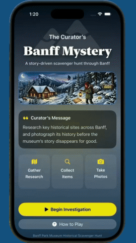

# Discover Banff: Legends and Lore (Android)

An interactive, story-driven mystery and adventure app built for Android using modern Jetpack Compose and Kotlin. 



This project is the native Android port of the original Swift/SwiftUI iOS application:
- **Original iOS Repository:** [vibrant-impact/iOSApp2](https://github.com/vibrant-impact/iOSApp2)

---

## Overview

Step into the shoes of a researcher exploring the historic winter landscapes and mysteries of Banff National Park. From unraveling the enigma of the Banff Park Museum and the Lost Lemon Mine to documenting wildlife and surviving a perilous encounter in Bigfoot's Lair, players uncover clues, collect inventory items, solve combination locks, and document evidence.

---

## Features

- **Interactive Hotspot Exploration:** High-resolution interactive environments with coordinate-based hotspot tap detection and zoom overlays.
- **Dynamic Inventory System:** Collect tools and artifacts (such as the Small Shovel, Gaff Hook, and Surveyor Notes) to solve environmental puzzles.
- **Atmospheric Audio Engine:** Multi-channel ambient audio lifecycle (snowy exterior winds, crackling fireplaces, cave drips, river rapids) coupled with low-latency `SoundPool` sound effects and haptic feedback.
- **Field Journal & Photo Capture:** In-game camera mechanics allowing players to photograph landmarks and legendary creatures to complete their field journal.
- **Cinematic Event Sequences:** Interactive animated narrative events, including timed lock decoders, cave icicle hazards, and dramatic transitions.

---

## Tech Stack & Architecture

- **Language:** Kotlin
- **UI Framework:** Jetpack Compose & Material 3
- **Architecture:** MVVM (Model-View-ViewModel) with unidirectional data flow
- **Audio:** Custom `SoundManager` utilizing Android `SoundPool` for responsive game sound effects and managed `MediaPlayer` for continuous looping ambient soundscapes
- **Graphics & Overlays:** Compose Canvas coordinate-scaling system mapping high-fidelity artwork (`1290 x 2796`) responsively across varying screen densities

---

## Project Structure

```text
app/src/main/java/com/vi/androidapp3/
├── audio/            # SoundManager, AmbientSound, GameSound, HapticsManager
├── data/             # Game models, InventoryItem, LocationId, Photo definitions
├── ui/
│   ├── components/   # Interactive overlays, camera views, combination lock, HUD
│   ├── hud/          # Top HUD, inventory bag, and journal triggers
│   └── locations/    # Scene composables (Museum, Bow Falls, Cave, Bigfoot Lair)
└── viewmodel/        # GameViewModel managing quest progression and game state
```

## Setup & Running

1. Clone the repository:
```text
git clone [https://github.com/vibrant-impact/AndroidApp3.git](https://github.com/vibrant-impact/AndroidApp3.git)
```
2. Open the project in Android Studio Ladybug (or newer).
3. Allow Gradle to sync dependencies.
4. Select an emulator or connected device running Android 9.0 (API 28) or higher.
5. Click Run (Shift + F10).

